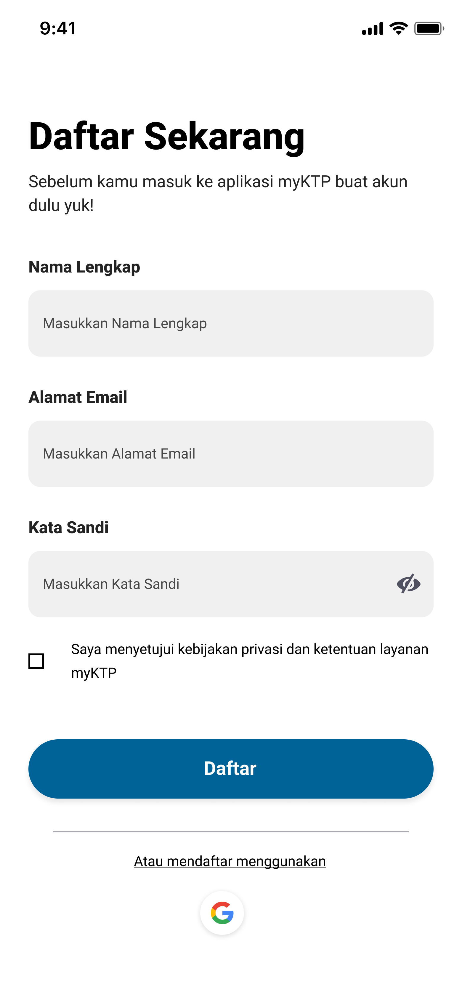
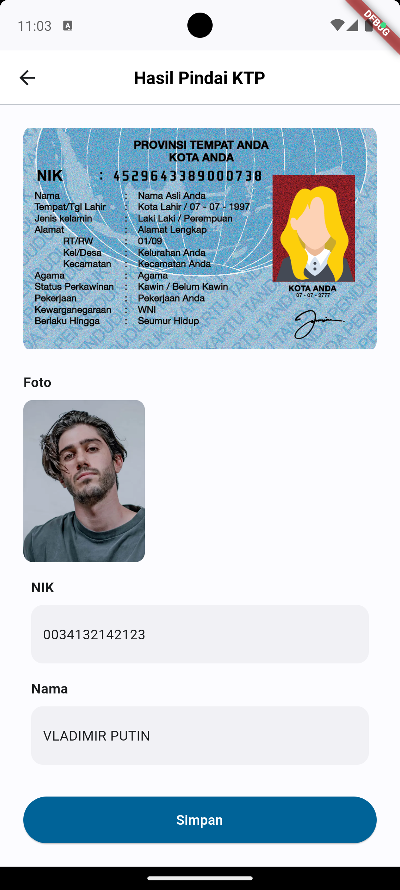
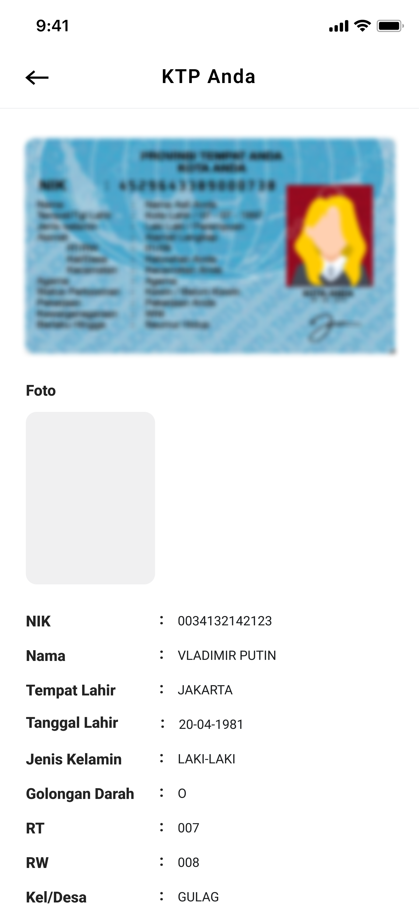
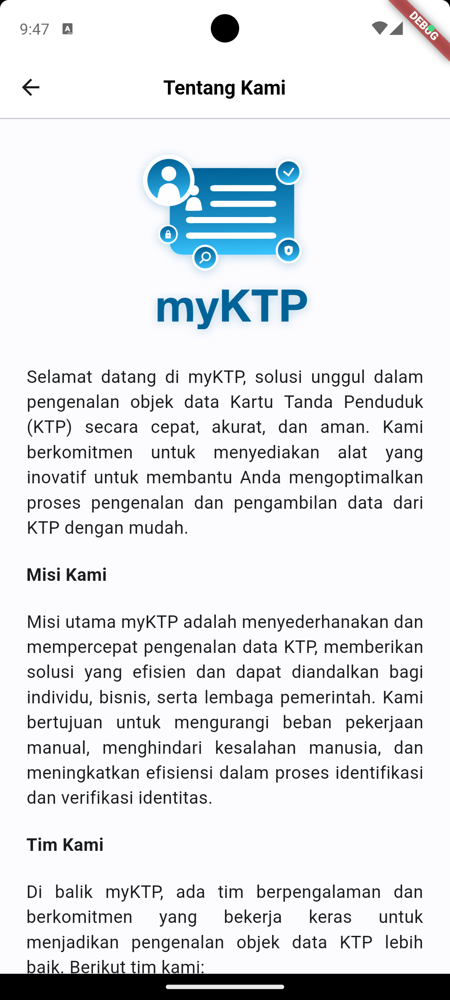

# **Aplikasi myKTP**

### **Anggota Kelompok**

Projek **myKTP** ini dibuat oleh kelompok 1 kelas TI-3H untuk menyelesaikan tugas UTS mata kuliah Pemrograman Mobile, yang beranggotakan sebagai berikut:

1. [Adam Rafi Rezandi](https://github.com/AdamPoi)
2. [Andi Dwi Prastyo](https://github.com/andidprastyo)
3. [Bima Bayu Sapura](https://github.com/BimaBayuUWUUU)
4. [Lailatul Badriyah](https://github.com/lailatulbadriyah24)
5. [Tio Misbaqul Irawan](https://github.com/indmind)

### **Description**

Selamat datang di **myKTP**, solusi unggul dalam pengenalan objek data Kartu Tanda Penduduk (KTP) secara cepat, akurat, dan aman. Kami berkomitmen untuk menyediakan alat yang inovatif untuk membantu Anda mengoptimalkan proses pengenalan dan pengambilan data dari KTP dengan mudah.

### **Screen dan PIC**
<table>
  <thead>
    <tr>
      <th>No.</th>
      <th>Nama Screen</th>
      <th>Fitur</th>
      <th>Tampilan (Figma)</th>
      <th>Tampilan (Actual)</th>
      <th>PIC</th>
    </tr>
  </thead>
  <tbody>
    <tr>
      <td>1</td>
      <td>Splash</td>
      <td>-</td>
      <td></td>
      <td></td>
      <td>Bima</td>
    </tr>
    <tr>
      <td>2</td>
      <td>Register</td>
      <td>Buat Akun</td>
      <td></td>
      <td></td>
      <td>Lailatul</td>
    </tr>
    <tr>
      <td>3</td>
      <td>Login</td>
      <td>Masuk ke Akun</td>
      <td></td>
      <td></td>
      <td>Lailatul</td>
    </tr>
    <tr>
      <td>4</td>
      <td>Dashboard</td>
      <td>
        Unggah KTP   Scan KTP   Riwayat   Unduh Data
      </td>
      <td></td>
      <td></td>
      <td>Bima</td>
    </tr>
    <tr>
      <td>5</td>
      <td>Camera</td>
      <td>Ambil Gambar KTP</td>
      <td></td>
      <td></td>
      <td>Tio</td>
    </tr>
    <tr>
      <td>6</td>
      <td>Scan</td>
      <td>Ambil Data KTP</td>
      <td></td>
      <td></td>
      <td>Adam</td>
    </tr>
    <tr>
      <td>7</td>
      <td>Success</td>
      <td>-</td>
      <td></td>
      <td></td>
      <td>Tio</td>
    </tr>
    <tr>
      <td>8</td>
      <td>Detail</td>
      <td>Lihat Data Hasil Scan</td>
      <td></td>
      <td></td>
      <td>Adam</td>
    </tr>
    <tr>
      <td>9</td>
      <td>Profile</td>
      <td>Lihat Informasi Akun</td>
      <td></td>
      <td></td>
      <td>Andi</td>
    </tr>
    <tr>
      <td>10</td>
      <td>Edit Profile</td>
      <td>Edit Informasi Profile</td>
      <td></td>
      <td></td>
      <td>Lailatul</td>
    </tr>
    <tr>
      <td>11</td>
      <td>About</td>
      <td>Informasi Seputar Aplikasi dan Copyright</td>
      <td></td>
      <td></td>
      <td>Andi</td>
    </tr>
  </tbody>
</table>

### **Link Figma**

[myKTP](https://www.figma.com/file/wPNvGmFh1RK1XG6IFo5pbW/Desain-UI?type=design&node-id=1-44797&mode=design&t=Ba2hSdCxFDb6XYsN-0)

### **Features**

- Pengambilan data KTP
- Pengenalan objek data KTP secara real-time

### **Credits**

